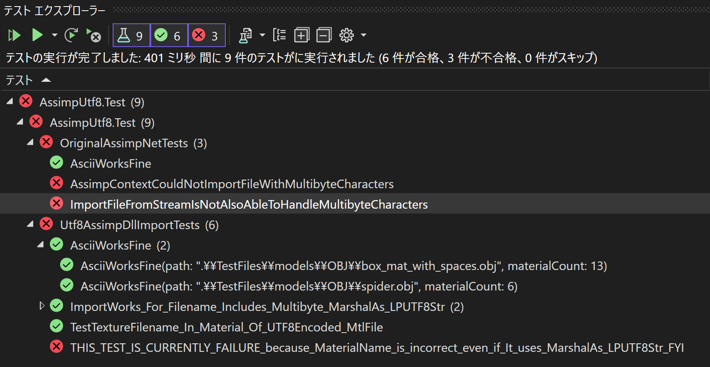

# An exmaple for [AssimpNet Issue #86](https://bitbucket.org/Starnick/assimpnet/issues/86/marshal-filename-to-utf-8)

## Motivation

Handle a filepath string as `UTF-8`.

`.NET` use Unicode as default, but `Assimp` expects `UTF-8`.

- OriginalAssimpNetTests : use an original `Assimp.AssimpContext` (failure)
- Utf8AssimpDllImportTests : use a modified `AssimpContext_ImportFile_MarshalAs_LPUTF8Str` (a cutout code of ImportFile)

In `AssimpContext_ImportFile_MarshalAs_LPUTF8Str`, use the same dll,
but it specifies `UnmanagedType.LPUTF8Str` instead of `UnmanagedType.LP8Str`
(passing string as `UTF-8` to a DLL).

There are more I/O functions to fix and test.

Although what I need is that `ImportWorks_For_Filename_Includes_Multibyte_MarshalAs_LPUTF8Str` works fine.

## Memo

This project is `.NET6` (I'm sorry, this is for my environment circumstances).

Just 'OBJ' is test. I use Visual Studio 2022.

## About TestFiles

`TestFiles` includes some OBJ model copied from [assimp/test/models/OBJ/](https://github.com/assimp/assimp/tree/master/test/models/OBJ),
and they are renamed with `emoji`. I choose `emoji` as a popular multibyte character for English people.

### why `📁\Spider🕸️.obj` is?

We usually aviod to use multibyte characters to filenames,
but it is slipped in to folder names unintentionally (or as copied filename's postfix at local language).

A filename with `emoji` is a terrible one. I use it as a description.

## Details of Tests

### OriginalAssimpNetTests fails to handle a filename with multibyte characters

- `AssimpContextCouldNotImportFileWithMultibyteCharacters` : a simple failure test.
- `ImportFileFromStreamIsNotAlsoAbleToHandleMultibyteCharacters` : this shows `ImportFileFromStream` helps to import an `OBJ` file, but it could not help to import a `MTL` file inside a DLL.

### Utf8AssimpDllImportTests

They mostly succeed.

One tes shows that could not handle Material name `Terraindæk` (`æ` was troubled).
It's not my concern at present, but I keep it FYI, don't care it seriously (`THIS_TEST_IS_CURRENTLY_FAILURE_because_MaterialName_is_incorrect_even_if_It_uses_MarshalAs_LPUTF8Str_FYI`).

It might be including another problem about code pages ([A Field Guide to Japanese Mojibake](https://www.dampfkraft.com/mojibake-field-guide.html)).

### Screenshot: Expected Test Results in Test Explorer

